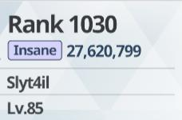
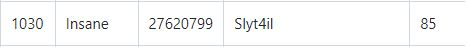

# Blue Archive Raid Leaderboard

**How?**
Use a script to automatically scroll the leaderboard on an android emulator and take screenshots of the score. Then use OCR to extract relevant information from them.

**Limitations**
The extraction of player names is hit-or-miss due to many players opting to use non-English characters in their names. The accuracy of the scores is acceptable but requires further cleaning to remove obvious errors.